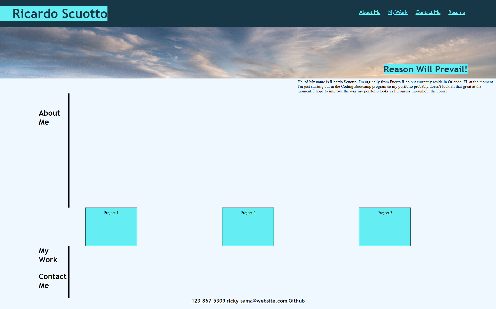

## Portfolio

``
I developed this webpage in hopes to showcase my work as an evergrowing programmer!
``

## Overview

```
Hello! Welcome to my Portfolio website. In my Portfolio website, 
it should contain various links providing information about myself, my projects, 
and how to contact me. The links to my projects should take you straight to the 
applications. If you want to use the header links at the top it will take you to 
various sections of the webpage depending on what link you clicked on. Most of 
the links don't work at the moment but they will be improved upon as I learn more.
```

## Mock-Up

The following image shows the web application's appearance and functionality:



Link to deployed website
https://ricky-sama.github.io/Portfolio/